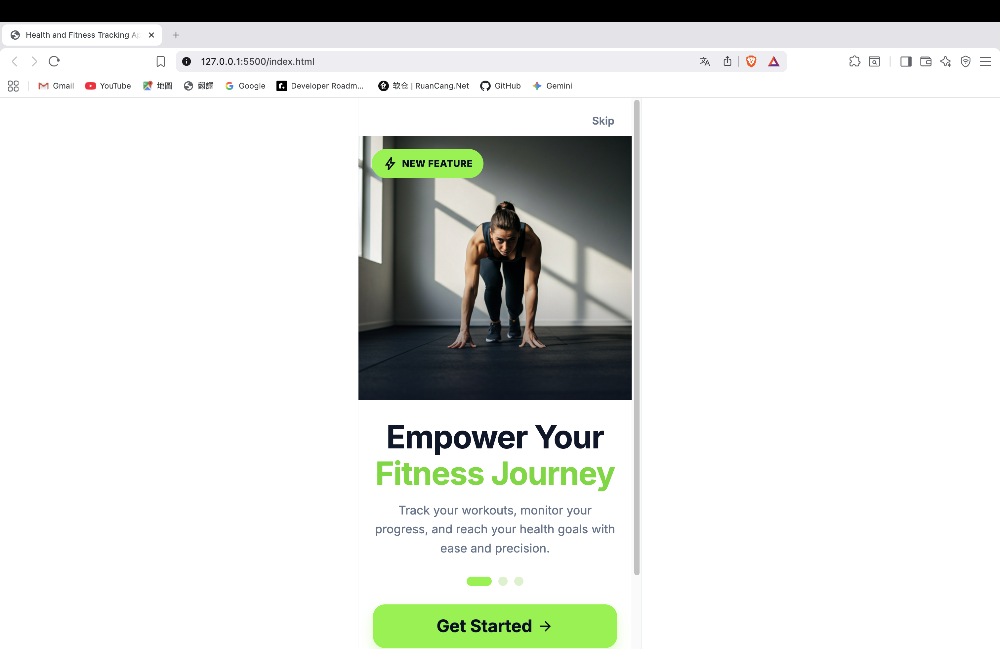

# IT1030SEF Group Project 21 — Health and Fitness Tracking App

A mobile-first web application for daily health tracking.

---

## Core Features
- Onboarding and login demo flow
- Home tracking (water, activity, calories)
- Workout filtering with inline video preview
- Metrics dashboard (BMI, calorie target, chart, and summary)
- Profile editing with localStorage persistence
- Manual light/dark theme switch

---

## Requirements
- [Visual Studio Code](https://code.visualstudio.com/)
- VS Code extension: **Live Server** (by Ritwick Dey)

---

## Quick Start

1. Download this repository as ZIP:
   ```
   git clone https://github.com/THAiTK2/IT1030SEF_Group_Project_21.git
   ```
2. Open the project folder in Visual Studio Code.
3. Install the **Live Server** extension.
   <br>
   
4. In VS Code, open `code/index.html`.
5. Right-click the file and choose **Open with Live Server**.
   - Windows shortcut: `Alt + L`, then `Alt + O`
   - macOS shortcut: `Option + L`, then `Option + O`
6. If successful, the app opens in your browser.
   <br>
   

---

## Project Structure

```text
code/
├── index.html
├── styles.css
├── js/
│   ├── app-state.js
│   ├── storage.js
│   ├── main.js
│   └── features/
│       ├── profile.js
│       ├── workouts.js
│       ├── metrics.js
│       └── theme.js
└── image/
    ├── default.png
    ├── login.png
    ├── on_boarding_screen.png
    ├── running.jpeg
    ├── Strength.png
    └── yoga.png
```

---

## Notes
- This is a front-end project using HTML, CSS, and JavaScript.
- No backend setup is required.
- Data is stored in browser `localStorage`.
- Login/social login features are demo flows (not production authentication).
